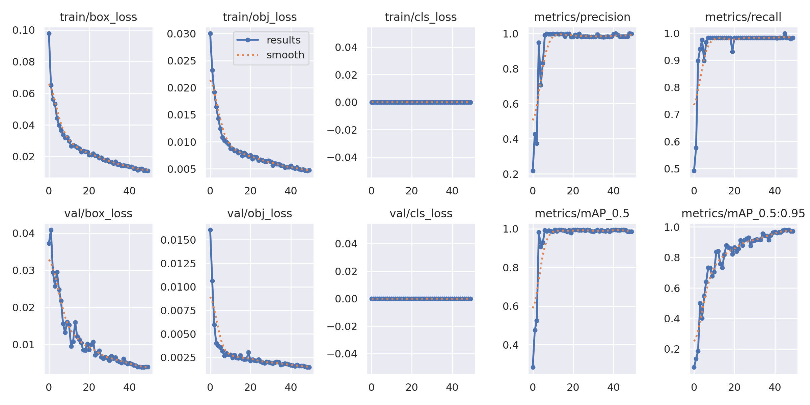
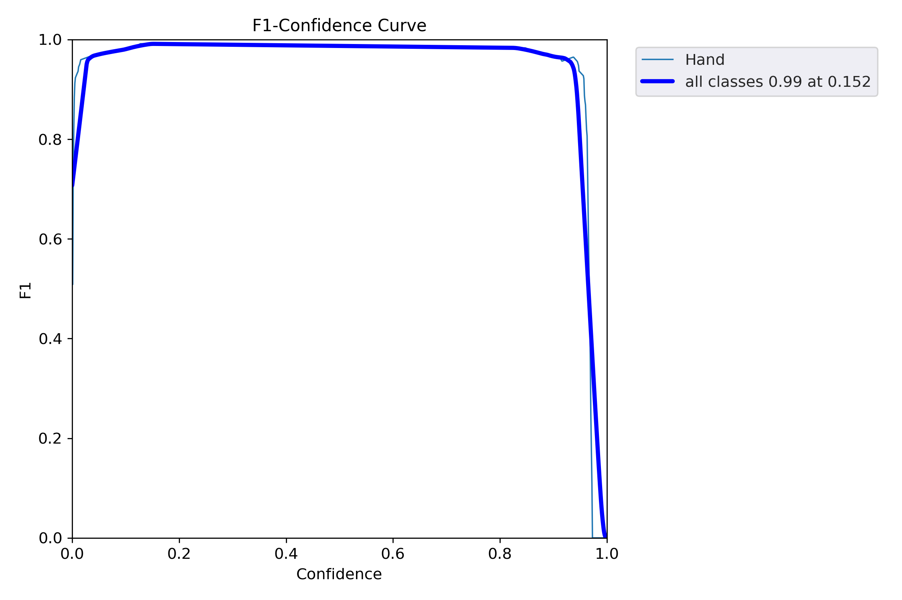
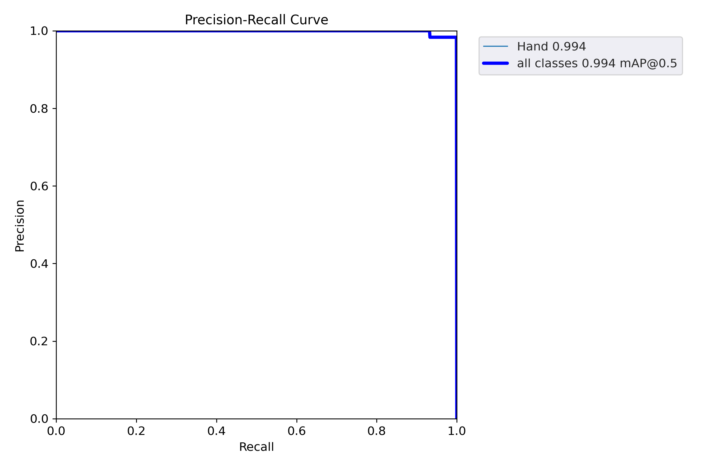
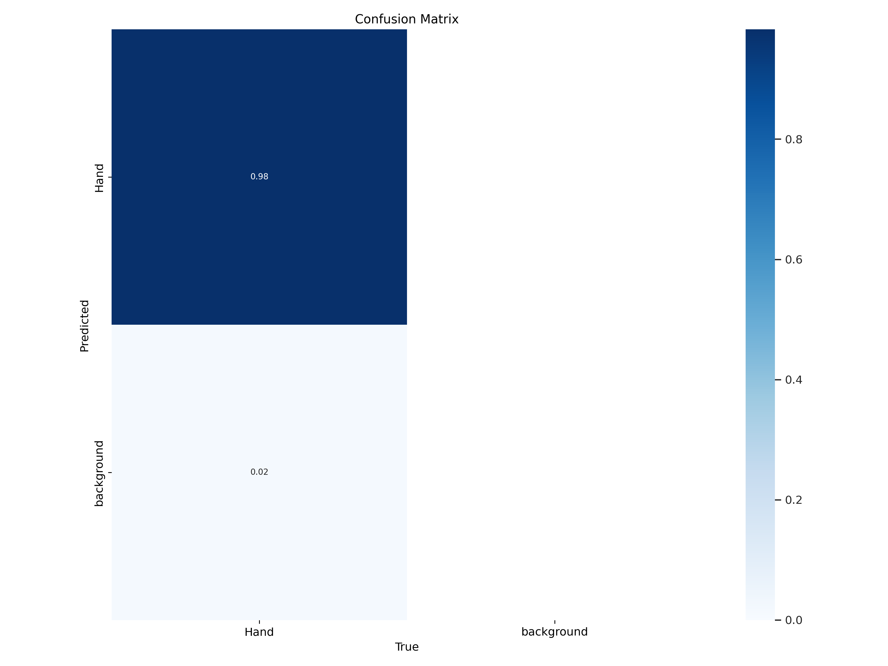

# Görev 21 - YOLOv5 Model Çıktılarının Analizi

## Genel Bakış

Bu belge, **el tespiti** için eğitilmiş özel bir YOLOv5s modelinin çıktılarını analiz etmektedir.  
Model, web kamerası ile toplanan 300 el görüntüsü üzerinde eğitilmiş, Roboflow ile etiketlenmiş ve Kaggle'da Tesla T4 GPU kullanılarak eğitilmiştir.

---

## Eğitim Özeti

| Parametre | Değer |
|-----------|-------|
| Model | YOLOv5s |
| Veri Seti | El Tespiti (özel) |
| Görüntü Sayısı | 300 (çekilmiş + artırılmış) |
| Epoch Sayısı | 50 |
| Görüntü Boyutu | 640×640 |
| Eğitim Süresi | ~0.19 saat |
| Donanım | Tesla T4 GPU (Kaggle) |

---

## Nihai Sonuçlar

| Metrik | Değer | Yorum |
|--------|-------|-------|
| **Precision (Kesinlik)** | 0.983 | Tespit edilen ellerin %98.3'ü gerçekten el |
| **Recall (Duyarlılık)** | 0.999 | Görüntülerdeki ellerin %99.9'u tespit edildi |
| **mAP@0.5** | 0.994 | IoU eşiği 0.5'te %99.4 genel doğruluk |
| **mAP@0.5:0.95** | 0.980 | Farklı IoU eşiklerinde %98 doğruluk |

---

## Metriklerin Açıklaması

### Precision (Kesinlik)
> "Modelin el dediği nesnelerin kaçı gerçekten eldi?"

- **Formül:** `Precision = TP / (TP + FP)`
- **Değerimiz: 0.983** → Yalnızca %1.7 yanlış tespit (model nadiren el olmayan şeyleri el olarak sınıflandırıyor)

### Recall (Duyarlılık)
> "Görüntülerdeki gerçek ellerin kaçını model buldu?"

- **Formül:** `Recall = TP / (TP + FN)`
- **Değerimiz: 0.999** → Model neredeyse hiçbir eli kaçırmadı (mükemmele yakın tespit oranı)

### F1 Skoru
> "Precision ve Recall arasındaki dengeli ölçüm"

- **Formül:** `F1 = 2 × (Precision × Recall) / (Precision + Recall)`
- **Hesaplanan:** `F1 = 2 × (0.983 × 0.999) / (0.983 + 0.999) ≈ 0.991`
- **Yorum:** Mükemmel denge — model hem doğru hem de eksiksiz çalışıyor

### mAP@0.5 (Ortalama Ortalama Kesinlik)
> "IoU ≥ 0.5'te genel tespit kalitesi"

- IoU (Kesişim/Birleşim), tahmin edilen kutunun gerçek kutuyla ne kadar örtüştüğünü ölçer
- **Değerimiz: 0.994** → Sınırlayıcı kutular çok doğru (%99.4)

---

## Çıktı Grafikleri

### results.png — Eğitim Süreci

50 epoch boyunca Kayıp (Loss) değerinin nasıl düştüğünü ve mAP'nin nasıl arttığını gösterir.  
Düzgün azalan kayıp eğrisi, modelin aşırı öğrenmeden iyi öğrendiğini doğrular.

---

### F1_curve.png — F1 Skoru ve Güven Eşiği

Farklı güven eşiklerinde F1 skorunu gösterir.  
En yüksek F1 noktası, modelin kullanımı için en uygun güven değerini belirtir.

---

### PR_curve.png — Precision-Recall Eğrisi

Sağ üst köşeye yakın bir eğri, hem yüksek Precision hem de yüksek Recall anlamına gelir.  
Eğri alanımız (mAP) = 0.995 olup mükemmele çok yakındır.

---

### confusion_matrix.png — Karışıklık Matrisi

Modelin her sınıfı ne sıklıkla doğru sınıflandırdığını gösterir.  
- **Gerçek Pozitif (el doğru tespit edildi):** Çok yüksek
- **Yanlış Pozitif (arka plan el olarak tespit edildi):** Çok düşük

---

## Sonuç

Özel eğitilmiş YOLOv5s el tespit modeli **üstün performans** elde etti:
- mAP@0.5: **%99.4**
- F1 Skoru: **%99.1**
- Neredeyse sıfır kaçırma oranı (Recall = %99.9)

Bu sonuçlar, modelin gerçek zamanlı el tespiti için son derece güvenilir olduğunu göstermektedir.  
Yüksek skorlar kısmen kontrollü eğitim ortamından kaynaklanmaktadır (görüntü çekimi sırasında tutarlı arka plan ve aydınlatma).
